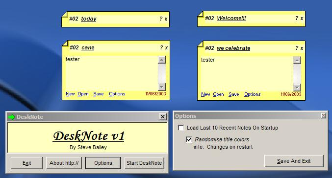



## DeskNote

### Description

ever wanted to store notes on your desktop? well this does just that! no more faffing around with notepad trying to find where u put that .txt file or whateva, with a few clicks here and there you can have a system up where ur notes load up on startup ready and waiting!! includes some 3rd party coding (which i thank you guys!!) and does the job well
 
### More Info
 

             |
---                |---
**Submitted On**   |2003-06-11 02:54:22
**By**             |[Aimee Bailey](https://github.com/Planet-Source-Code/PSCIndex/blob/master/ByAuthor/aimee-bailey.md)
**Level**          |Intermediate
**User Rating**    |5.0 (30 globes from 6 users)
**Compatibility**  |VB 6\.0
**Category**       |[Complete Applications](https://github.com/Planet-Source-Code/PSCIndex/blob/master/ByCategory/complete-applications__1-27.md)
**World**          |[Visual Basic](https://github.com/Planet-Source-Code/PSCIndex/blob/master/ByWorld/visual-basic.md)
**Archive File**   |[DeskNote1599646112003\.zip](https://github.com/Planet-Source-Code/aimee-bailey-desknote__1-46106/archive/master.zip)

### Source Code

visit http://www.hybrid-factor.co.uk/dn/index.htm for desknote homepage. (fixed missing files in the zip)

